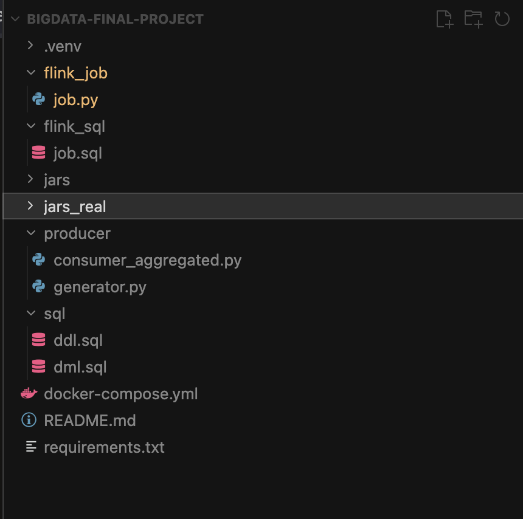
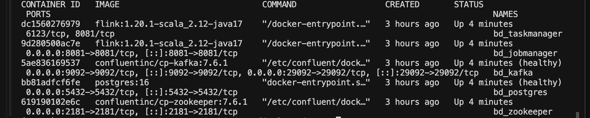
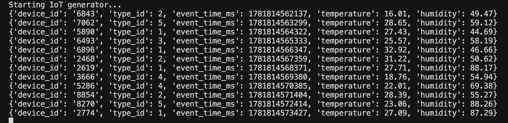
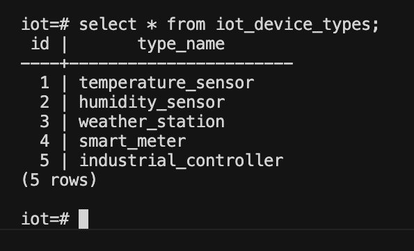
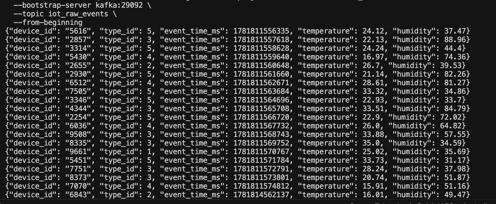
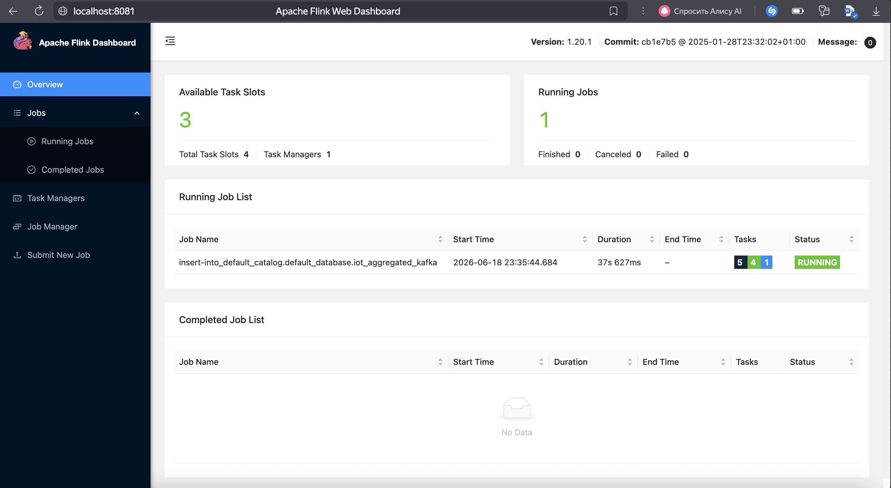
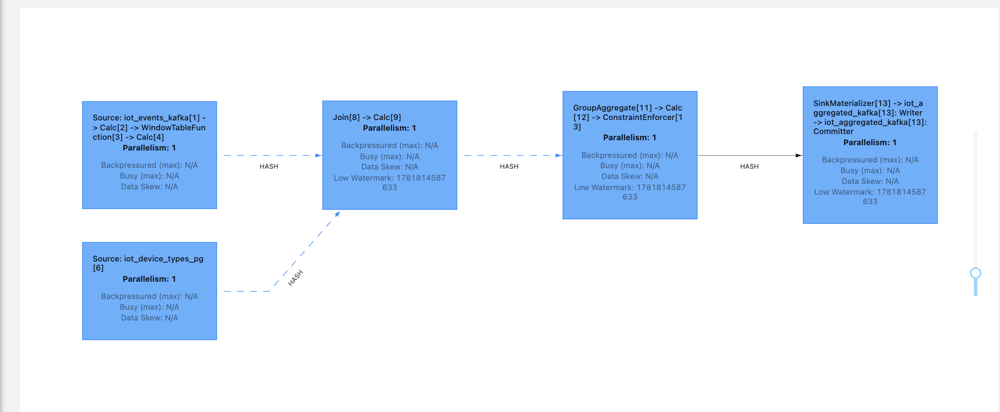
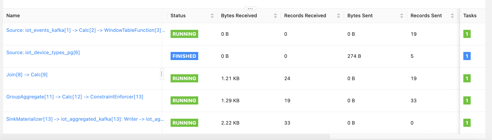
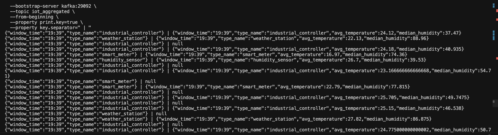
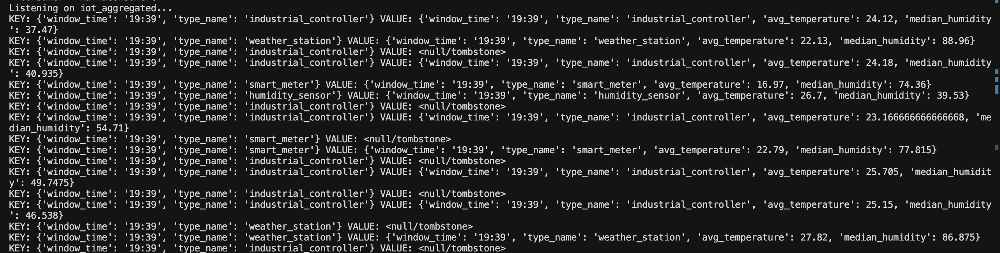

# Финальный проект по потоковой обработке IoT-данных

## Что это за проект
В этом проекте я собрала небольшой end-to-end pipeline для потоковой обработки IoT-событий. Идея простая: есть генератор сообщений, который раз в секунду создаёт телеметрию от устройств, дальше эти события попадают в Kafka, потом обрабатываются во Flink, обогащаются справочником из PostgreSQL и сохраняются обратно в Kafka уже в агрегированном виде.

По требованиям задания нужно было сделать генерацию IoT-событий, Kafka как источник и приёмник, справочник типов устройств в PostgreSQL, обработку во Flink в event time, join со справочником и минутную агрегацию. В текущем варианте всё это реализовано через Flink SQL/Table API.

## Структура проекта
Ниже показана структура файлов проекта. В отдельные папки вынесены Python-скрипты, SQL-скрипты и Flink job, чтобы было проще ориентироваться в решении.

На скрине видно, что в проекте есть генератор `generator.py`, consumer для чтения итогового потока `consumer_aggregated.py`, SQL-скрипты `ddl.sql` и `dml.sql`, а также основной Flink SQL job `job.sql`. Этого набора файлов достаточно, чтобы поднять инфраструктуру, заполнить справочник и прогнать поток от генерации до агрегированного результата.

## Инфраструктура в Docker
Вся инфраструктура поднимается в Docker: Kafka, Zookeeper, PostgreSQL, Flink JobManager и Flink TaskManager. Это удобно, потому что весь проект можно воспроизвести локально без отдельной ручной установки сервисов.

На скрине видно, что контейнеры `bd_kafka`, `bd_postgres`, `bd_jobmanager`, `bd_taskmanager` и `bd_zookeeper` находятся в статусе `Up`. Этого достаточно, чтобы генератор мог писать в Kafka, Flink мог читать поток и выполнять job, а PostgreSQL — отдавать справочные данные для join.

## Генерация событий
Для генерации входных данных используется Python-скрипт `generator.py`. Он раз в секунду создаёт JSON-событие со следующими полями: `device_id`, `type_id`, `event_time_ms`, `temperature`, `humidity`, после чего отправляет сообщение в Kafka topic `iot_raw_events`.

На скрине видно, что генератор действительно работает в реальном времени: каждую секунду появляется новое событие с типом устройства, временной меткой и измерениями температуры и влажности. Это закрывает первую часть задания — реализацию генератора IoT-сообщений.

## Справочник типов устройств
Отдельно в PostgreSQL создан справочник типов устройств. Для него подготовлены `ddl.sql` и `dml.sql`: первый скрипт создаёт таблицу `iot_device_types`, а второй наполняет её тестовыми значениями.

На скрине видно содержимое таблицы `iot_device_types`: каждому числовому `id` соответствует понятное имя типа устройства, например `temperature_sensor`, `weather_station` или `industrial_controller`. Этот справочник потом используется во Flink для join с потоком из Kafka.

## Сырые события в Kafka
Сгенерированные IoT-сообщения попадают в Kafka topic `iot_raw_events`. Это основной входной поток, который потом читает Flink SQL job.

На скрине видно сырые JSON-сообщения в Kafka: у каждого есть `device_id`, `type_id`, `event_time_ms`, `temperature` и `humidity`. То есть генератор и Kafka source работают корректно, а данные доходят до брокера в ожидаемом формате.

## Обработка во Flink
Основная логика обработки реализована во Flink через SQL/Table API. В `job.sql` создаются три таблицы: Kafka source `iot_events_kafka`, JDBC source `iot_device_types_pg` и Kafka sink `iot_aggregated_kafka`. После этого поток соединяется со справочником и агрегируется по минутным окнам.

Для работы в event time входное поле `event_time_ms` преобразуется во Flink в timestamp через `TO_TIMESTAMP_LTZ(event_time_ms, 3)`, а затем на него задаётся watermark. Это позволяет обрабатывать поток по времени события, а не по времени фактического прихода записи в систему.

## Flink Dashboard и статус job
После запуска SQL job он появляется в Apache Flink Web Dashboard. Это полезно и для контроля состояния pipeline, и для демонстрации проекта на защите.

На этом скрине видно, что во Flink есть один `Running Job`, а основная insert-job находится в статусе `RUNNING`. Это означает, что потоковая обработка активна, и данные непрерывно проходят через pipeline.

## Внутренняя схема обработки
Во Flink job видно, как именно устроена обработка. Поток событий приходит из Kafka, справочник читается из PostgreSQL, после чего выполняется join, затем group aggregation по окнам и запись в sink.

На схеме видно два источника: `iot_events_kafka` и `iot_device_types_pg`. Затем они сходятся в `Join`, после чего выполняется `GroupAggregate`, а результат отправляется в `iot_aggregated_kafka`. Это хорошо иллюстрирует основную идею проекта: обогатить поток справочником и посчитать итоговые метрики.

## Детали выполнения job
Во Flink UI также видно состояние отдельных операторов. Это позволяет убедиться, что source, join, aggregation и sink реально работают, а не просто формально описаны в SQL.

На скрине видно, что Kafka source, join, агрегирующий оператор и sink находятся в статусе `RUNNING`. Отдельно видно, что чтение справочника из PostgreSQL уже завершилось (`FINISHED`), что логично для статичного справочника.

## Оконная агрегация и итоговый Kafka topic
По заданию нужно было посчитать минутные агрегаты и записать результат обратно в Kafka. В проекте результат сохраняется в topic `iot_aggregated` в формате: время окна `hh:mm`, тип устройства из PostgreSQL, средняя температура и агрегат по влажности.

На скрине видно содержимое Kafka topic `iot_aggregated`. В key присутствуют `window_time` и `type_name`, а в value — итоговые агрегаты `avg_temperature` и `median_humidity`. Также видны `null`-сообщения, потому что используется `upsert-kafka`, и для обновлений Flink может отправлять tombstone-записи.

## Чтение агрегированного потока
Для удобной демонстрации результата я использовала отдельный Python-скрипт `consumer_aggregated.py`, который читает сообщения из topic `iot_aggregated` и печатает их в консоль.

На скрине видно, что consumer получает и обычные сообщения с агрегатами, и tombstone-записи. Это полезно, потому что можно сразу показать не только факт записи результата в Kafka, но и то, что используется upsert-семантика, а значит значения по ключу могут переопределяться по мере обновления окна.

## Что в итоге считается
Логика расчёта такая: события группируются по минутным tumbling windows и по типу устройства. Для каждой группы считается средняя температура, а также значение влажности, которое в текущей реализации сохранено в поле `median_humidity`.

Здесь есть важный нюанс: в моём текущем SQL job поле `median_humidity` фактически вычисляется через `AVG(humidity)`, а не через настоящую медиану. С точки зрения демонстрации streaming pipeline это не ломает проект, но формально это стоит оговорить как упрощение текущей версии.

## Что с bridge между DataStream и SQL/Table API
Отдельно отмечу проблему с пунктом про bridge между `DataStream API` и `SQL/Table API`. Основная обработка в проекте сделана через Flink SQL/Table API, потому что для задачи вида Kafka -> join со справочником -> window -> Kafka это самый короткий и понятный путь.

При этом явный переход `DataStream <-> Table` в текущую рабочую версию я не добавляла. Причина не в том, что этого нельзя сделать в принципе, а в том, что на Python это требовало бы отдельного PyFlink-контура и совместимой версии Python, а текущий проект уже был собран и работал как SQL pipeline. Из-за этого я решила не ломать рабочую конфигурацию перед сдачей и оставить bridge как отдельное потенциальное расширение, а не часть основного решения.

## Небольшая проблема, с которой пришлось столкнуться
Во время подготовки отчёта у меня ещё была практическая проблема: после ручного рестарта контейнеров через Docker Flink UI показывал пустой dashboard без running jobs. Это произошло потому, что сам кластер поднялся, но SQL job после перезапуска нужно было запускать заново вручную.

После повторного запуска `job.sql` pipeline снова заработал, и job появился во Flink Dashboard в статусе `RUNNING`. Это был полезный опыт: стало понятно, что `healthy` у Kafka и PostgreSQL не означает автоматическое восстановление Flink job после рестарта контейнера.

## Что можно сказать по соответствию заданию
Если смотреть по основным пунктам, то проект закрывает почти всё, что требовалось:

- есть генератор IoT-сообщений раз в секунду;
- есть Kafka как source для сырых событий;
- есть PostgreSQL со справочником типов устройств;
- есть Flink SQL job с event time и watermark;
- есть join потока со справочником;
- есть минутная оконная агрегация;
- есть Kafka sink с итоговым потоком.

Самый спорный момент в текущей версии — это отсутствие отдельного bridge между `DataStream API` и `SQL/Table API`, а также то, что `median_humidity` сейчас считается как среднее значение. Но сам pipeline от генерации до результата полностью рабочий и демонстрирует все основные элементы streaming-архитектуры.

## Итог
В результате получился рабочий учебный проект по потоковой обработке IoT-данных. Он показывает типичную real-time архитектуру: генератор пишет сырые события в Kafka, Flink читает их, обогащает справочником из PostgreSQL, считает оконные агрегаты и сохраняет итог в отдельный Kafka topic.

Мне было важно не просто написать файлы, а действительно довести pipeline до состояния, где его можно поднять, посмотреть во Flink UI, проверить данные в Kafka и увидеть агрегированный результат в консольном consumer. Именно поэтому итоговая версия проекта получилась не идеальной в плане всех формальных пунктов, но зато полностью живой и воспроизводимой.
